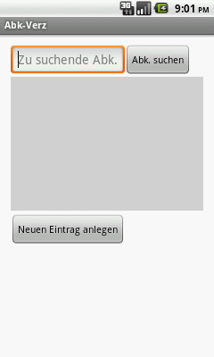
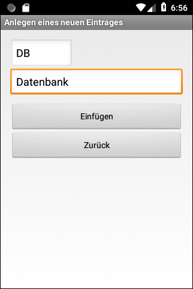
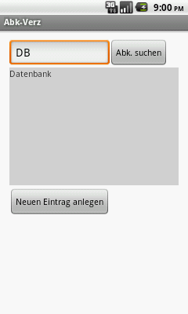

# Android-App: "AbkVerz" #

 

Quellcode für eine native Android-App (Projekt für *Android Studio* mit Java), die demonstriert, wie man eine SQLite-Datenbank verwendet,
um Abkürzungen zu speichern und zu durchsuchen.

 

SQL-Dateien zum Testen mit dem Kommandozeilenprogramm SQLite3 (z.B. *sqlite3.exe* unter Windows) finden Sie im Unterordner [SQL/](SQL).
Diese Dateien werden NICHT in die von *Android Studio* generierte App-Datei (APK-Datei) aufgenommen.

Siehe [dieses Repository](https://github.com/MDecker-MobileComputing/Android_AbkVerzMitRoom) für eine Variante dieser App, die die 
[Room Persistence Library](https://developer.android.com/training/data-storage/room?hl=lt) (ORM für Android) verwendet.

 

----

## Screenshots ##

 

 &nbsp; 

 

----

## License ##

 

See the [LICENSE file](LICENSE.md) for license rights and limitations (BSD 3-Clause License).

 
